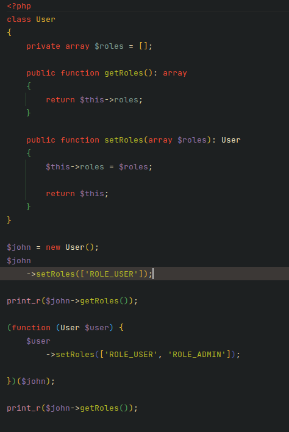
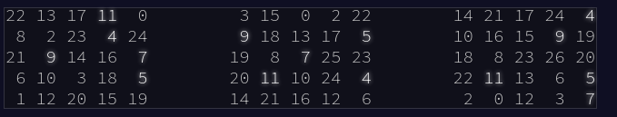
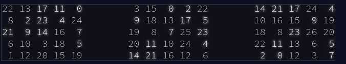
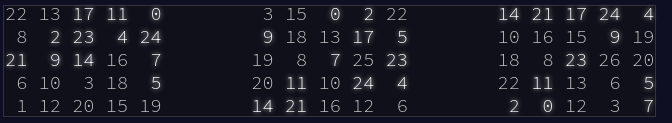

# Test PHP

Bienvenue dans le test PHP. Ce test est prévu pour durer environ 1h30.

Les questions porteront sur PHP. Ce qui nous intéresse c'est la reflexion globale que tu peux avoir plus que des
bonnes réponses à toutes les questions.

Bonne chance.


## Question 1

Quelle est la dernière version de PHP ?

### Réponse


## Question 2

En rapport avec la question précédente : qu'est-ce que cette nouvelle version apporte de plus que la précédente ?

### Réponse


## Question 3

Quelle est la différence entre `include` et `require` ?

### Réponse


## Question 4

Quelle méthodologie utilises-tu pour debugger une application PHP ?

### Réponse


## Question 5

Peux-tu expliquer pourquoi dans le code suivant la valeur de `$x` vaut `true` ?

```php
$x = true and false;
```

### Réponse


## Question 6

Donner des exemples de méthodes magiques en PHP. Quand ces méthodes sont-elles appelées ?

### Réponse


## Question 7

Qu'est-ce qu'une PSR ? Quelles PSR utilisez-vous ?

### Réponse


## Question 8

Qu'est-ce qu'une interface en programmation orientée objet ?

### Réponse


## Question 9

À quoi servent les design pattern ? Pouvez-vous donner les principaux que vous utilisez ?

### Réponse


## Question 10

Que va afficher le code suivant ?



### Réponse


## Question 11

La réponse à cette question devra être implémentée en PHP.

Le bingo se joue sur un ensemble de tableauxs composés chacun d'une grille de numéros 5x5.
Les numéros sont tirés au hasard et le numéro choisi est marqué sur tous les tableaux sur lesquels il
apparaît (les nombres peuvent ne pas apparaître sur tous les tableaux).

Si tous les numéros d'une rangée ou d'une colonne d'un tableau sont marqués, ce tableau est gagnant
(les diagonales ne comptent pas).

Par exemple :

```
7,4,9,5,11,17,23,2,0,14,21,24,10,16,13,6,15,25,12,22,18,20,8,19,3,26,1

22 13 17 11  0
 8  2 23  4 24
21  9 14 16  7
 6 10  3 18  5
 1 12 20 15 19

 3 15  0  2 22
 9 18 13 17  5
19  8  7 25 23
20 11 10 24  4
14 21 16 12  6

14 21 17 24  4
10 16 15  9 19
18  8 23 26 20
22 11 13  6  5
 2  0 12  3  7
 ```

Une fois les cinq premiers numéros tirés (7, 4, 9, 5 et 11), il n'y a pas de grilles gagnantes, mais les
tableaux sont marqués comme suit (indiqués ici côte à côte pour économiser de l'espace) :



Après le tirage des six numéros suivants (17, 23, 2, 0, 14 et 21), il n'y a toujours pas de gagnant :



Enfin, 24 est tiré :



À ce stade, le troisième tableau gagne, car il a au moins une ligne ou une colonne complète de nombres marqués
(dans ce cas, toute la ligne du haut est marquée : 14 21 17 24 4).

Le score du tableau gagnant peut maintenant être calculé.

Commencez par trouver la somme de tous les nombres non marqués sur ce tableau  dans ce cas, la somme est
de 188. Ensuite, multipliez cette somme par le nombre qui vient d'être appelé lorsque le tableau a gagné, 24,
pour obtenir le score final, 188 * 24 = 4512.

Dans la grille [qui vous est donnée ici](./data/exo/01.txt), déterminez quel tableau gagnera en premier.

Quel sera le score final si vous choisissez ce tableau ?

### Réponse


